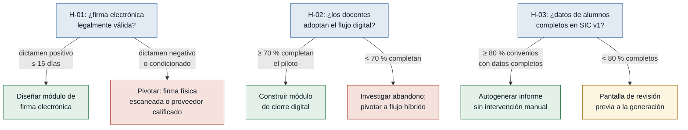

# Hipótesis y experimentos — Discovery CIC (SIC v2)

> Generado por `/discovery:experiments discoveries/cic`
> Fuente: `mvp-canvas.md` (sección "Supuestos más riesgosos")
> Ordenadas de mayor a menor riesgo.

---

## Árbol de decisión global

---

### [H-01] Validez legal de la firma electrónica ante la contraloría — riesgo: alto

- **Supuesto a probar:** La firma electrónica tiene valor jurídico suficiente para la contraloría y la institución en el contexto de los Actas de Finiquito de convenios académicos.
- **Hipótesis:** Creemos que la Directora de Alianzas logrará cerrar convenios con plena validez legal si los Actas de Finiquito se firman electrónicamente dentro del SIC v2, porque la legislación reconoce la firma electrónica en documentos institucionales y la contraloría la acepta como evidencia de cierre formal.
- **Señal medible:** Dictamen escrito del Área Legal institucional confirmando o rechazando la validez de la firma electrónica para actas de finiquito de convenios ante la contraloría.
- **Criterio de éxito:** Dictamen positivo emitido en ≤ 15 días hábiles desde la consulta formal, sin condicionamientos que obliguen a rediseñar el flujo de cierre previsto.
- **Experimento:** Entrevista dirigida al responsable del Área Legal + revisión del marco regulatorio (Ley de Comercio Electrónico ecuatoriana, normativas internas de contraloría). Se le presenta una simulación del flujo de firma y se pregunta si cumpliría los requisitos de auditoría.
- **Caja de tiempo/costo:** 5 días hábiles de revisión interna · costo ≈ 0.
- **Regla de decisión:** Si pasa → diseñar el módulo de firma electrónica con el mecanismo validado por Legal. Si falla (dictamen negativo o condicionado) → descartar firma electrónica nativa y pivotar a flujo de firma física escaneada + sello de recepción digital, o evaluar un proveedor de firma electrónica calificada (cambio de alcance antes de construir).

---

### [H-02] Adopción del docente al flujo de cierre digital — riesgo: alto

- **Supuesto a probar:** Los docentes gestores de convenios adoptarán el flujo de cierre digital del SIC v2 en lugar de continuar con el proceso actual de Word + firma física presencial.
- **Hipótesis:** Creemos que al menos el 70 % de los profesores gestores completarán el cierre de un convenio vencido dentro del SIC v2 si la herramienta genera el informe técnico automáticamente y notifica a las partes, porque el principal obstáculo declarado es el tiempo de redacción manual y la persecución de firmas físicas.
- **Señal medible:** Tasa de completitud del flujo de cierre digital: porcentaje de cierres iniciados en el piloto que llegan a Acta de Finiquito con todas las firmas requeridas, sin intervención manual del equipo de desarrollo.
- **Criterio de éxito:** ≥ 70 % de los cierres iniciados completados en ≤ 5 días hábiles, sobre una muestra mínima de 5 convenios vencidos reales.
- **Experimento:** **Mago de Oz / Concierge** — 5 profesores cierran sus convenios vencidos usando un formulario digital simple (Google Form o equivalente); el equipo genera el informe técnico y el acta en PDF de forma manual detrás de bambalinas. Se mide cuántos completan el proceso completo vs. cuántos abandonan o vuelven al flujo Word+físico.
- **Caja de tiempo/costo:** 2 semanas · costo ≈ 0.
- **Regla de decisión:** Si pasa (≥ 70 % completan) → construir el módulo de cierre digital con alta confianza en la adopción. Si falla (< 70 %) → investigar el paso de abandono con entrevista post-test a quienes desertaron; pivotar hacia flujo híbrido (digital para el informe, física para la firma) o rediseñar el paso de fricción antes de construir.

---

### [H-03] Completitud de los datos de alumnos en el SIC v1 — riesgo: medio

- **Supuesto a probar:** Los registros de participación de alumnos almacenados en el SIC v1 son suficientemente completos para precargar automáticamente el informe técnico de cierre sin intervención manual del docente.
- **Hipótesis:** Creemos que la generación automática del informe técnico de cierre funcionará para al menos el 80 % de los convenios vencidos si se extraen los datos de alumnos del SIC v1, porque los alumnos fueron vinculados al convenio durante el proceso de inscripción a prácticas.
- **Señal medible:** Porcentaje de convenios vencidos en el SIC v1 cuyos registros de alumnos tienen los 3 campos mínimos completos: nombre, carrera y período de participación.
- **Criterio de éxito:** ≥ 80 % de los convenios vencidos con los 3 campos completos y correctos en la base de datos del SIC v1.
- **Experimento:** **Auditoría de datos del SIC v1** — consulta directa a la base de datos (o revisión del dump exportable) para contar cuántos convenios vencidos tienen registros de alumnos con los campos mínimos completos vs. cuántos están vacíos o incompletos.
- **Caja de tiempo/costo:** 1-2 días · costo ≈ 0.
- **Regla de decisión:** Si pasa (≥ 80 % completos) → construir la generación automática del informe con confianza en los datos. Si falla (< 80 %) → descartar la generación totalmente automática; pivotar hacia una pantalla de revisión/corrección de datos que el docente completa antes de generar el informe, reduciendo el esfuerzo de redacción pero sin eliminarlo del todo.

---

## Hoja de ruta de experimentos

| Prioridad | ID | Supuesto | Experimento | Costo | Duración |
|---|---|---|---|---|---|
| 1 | H-01 | Firma electrónica legal | Entrevista a Legal + revisión normativa | ~0 | 5 días |
| 2 | H-02 | Adopción del docente | Mago de Oz con 5 cierres reales | ~0 | 2 semanas |
| 3 | H-03 | Datos de alumnos completos | Auditoría de BD del SIC v1 | ~0 | 1-2 días |

> **Por qué en este orden:** H-01 se prueba primero porque si la firma electrónica no es válida legalmente, todo el módulo de cierre requiere un rediseño fundamental antes de gastar tiempo en H-02 o construir nada. H-02 se prueba antes de construir el módulo porque el riesgo de no-adopción anula la métrica de éxito del MVP. H-03 se puede probar en paralelo a H-02 con un costo mínimo.
