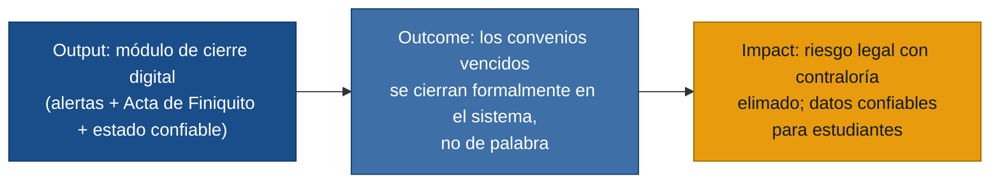

# MVP Canvas — SIC v2 (Sistema de Información de Convenios, versión 2)

> Generado por `/discovery:generate-mvp discoveries/cic`
> Fuentes: `personas.md`, `requisitos.md`, `evidence-map.json`

---

## Cadena de valor del MVP

---

## Canvas

| Bloque | Contenido |
|---|---|
| **Propuesta de valor** | El SIC v2 cierra el ciclo de vida del convenio académico: detecta el vencimiento con 30 días de anticipación, guía el cierre formal con Acta de Finiquito digital y firma electrónica, y garantiza que el estado mostrado a los estudiantes refleje siempre la realidad. |
| **Segmento de usuarios** | **Primarios (operativos):** Fundadora / Directora de Alianzas y Profesores gestores de convenios. **Beneficiario directo:** Estudiante que consulta oportunidades de práctica. |
| **Funcionalidades mínimas** | 1. Motor de alertas automáticas: notificación a docente y contraparte 30 días antes del vencimiento. 2. Módulo de cierre digital: generación del Acta de Finiquito prellenada + flujo de firma electrónica. 3. Generación automática del informe técnico de alumnos para adjuntar al acta. 4. Panel del docente: vista filtrada de sus convenios a cargo. 5. Indicador de estado en tiempo real (semáforo verde/ámbar/rojo) visible para estudiantes. |
| **Resultado esperado (outcome)** | Los convenios vencidos dejan de operar "de palabra": se cierran con documento firmado dentro del sistema. El porcentaje de convenios caducados sin Acta de Finiquito baja del ~20 % estimado actual. |
| **Métrica de éxito** | **≥ 80 % de los convenios que venzan en los 6 meses posteriores al lanzamiento cuentan con Acta de Finiquito digital firmada antes de los 30 días del vencimiento** (línea base: ~0 % hoy). *Prueba ácida: si este porcentaje supera el 80 %, la dirección puede presentar el sistema ante la contraloría como mecanismo de control de cumplimiento; si falla, hay que investigar adopción y rediseñar el flujo.* |
| **Riesgos / supuestos** | 1. La firma electrónica es legalmente aceptada por la contraloría institucional (supuesto crítico no validado). 2. Los docentes adoptarán el flujo digital en lugar de seguir usando Word + físico. 3. Las contrapartes externas aceptarán firmar digitalmente (pueden no tener herramientas). 4. Los datos de alumnos en el SIC v1 son suficientemente completos para precargar el informe técnico. |
| **Fuera de alcance (por ahora)** | **Postulación digital de estudiantes con CV en PDF** — es un dolor real pero no el que más duele ni el que genera riesgo legal. **Buscador con filtros por carrera** — el estado confiable (semáforo) resuelve el dolor más agudo primero. **Registro de adendas / modificaciones** — importante, pero el flujo de cierre es la prioridad de la dirección. **Rediseño completo de la interfaz de usuario** — diferido; la UX puede mejorar en paralelo sin bloquear el núcleo. |

---

## Supuestos más riesgosos (para `/discovery:experiments`)

1. **Firma electrónica legalmente válida:** si la contraloría no la acepta, el Acta de Finiquito digital no tiene valor jurídico y todo el módulo de cierre cae.
2. **Adopción del docente:** si el profesor prefiere el flujo Word+físico, los convenios seguirán cerrándose fuera del sistema.
3. **Completitud de datos en el SIC v1:** si los registros de alumnos están incompletos, la generación automática del informe técnico no funciona y el dolor del profesor no se resuelve.
