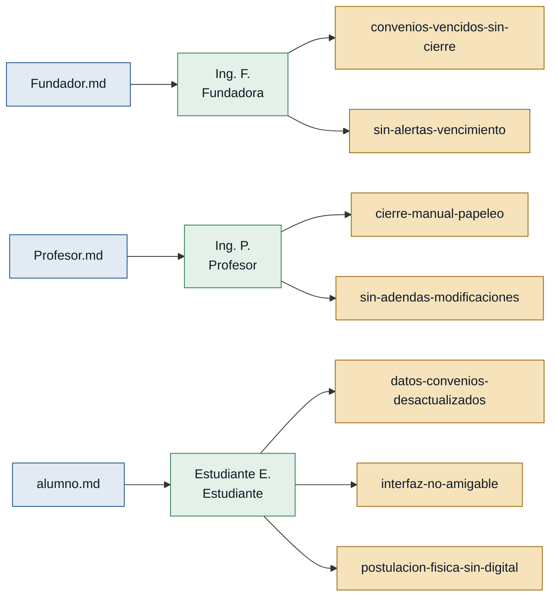

# Personas — Discovery CIC (SIC v2)

> Generado por `/discovery:analyze discoveries/cic`
> Fuentes: `Fundador.md`, `Profesor.md`, `alumno.md`

---

## Mapa de trazabilidad

> Leyenda de persona: verde = respaldo de primera mano · ámbar = solo referenciada

---

## Personas

### Ing. F. — fundadora / directora de alianzas

- **Contexto:** Directora del Área de Alianzas Estratégicas Institucionales, responsable de custodiar la vigencia y el cierre legal de los convenios.
- **Objetivo principal:** Que el 100 % de los convenios vencidos queden cerrados formalmente en el sistema con su Acta de Finiquito digital, eliminando el riesgo legal ante la contraloría.
- **Dolores:**
  - Aproximadamente el 20 % de los convenios en la base de datos ya caducaron en la realidad, pero ninguno tiene Acta de Finiquito firmada; el riesgo legal es grave. `(Fundador.md)`
  - El sistema no emite alertas previas al vencimiento: los convenios expiran de forma silenciosa. `(Fundador.md)`
  - La versión 1 del SIC fue construida en cascada: cualquier ajuste exige una nueva versión completa, lo que congela la mejora continua. `(Fundador.md)`
- **Respaldo:** `primera mano` — entrevista directa en `Fundador.md` (`primera_persona: true`).

---

### Ing. P. — profesor / gestor de convenios

- **Contexto:** Docente universitario que negocia alianzas académicas con empresas externas y es responsable operativo de los convenios que gestiona.
- **Objetivo principal:** Reducir el tiempo y el papeleo en el cierre de convenios para dedicarse a captar nuevas alianzas.
- **Dolores:**
  - Cerrar un convenio vencido requiere redactar informes en Word desde cero, imprimir y perseguir firmas físicas durante meses. `(Profesor.md)`
  - El SIC v1 no permite registrar adendas ni modificaciones: cualquier cambio obliga a cancelar el registro original y empezar de nuevo. `(Profesor.md)`
  - El sistema no ofrece un panel de seguimiento propio; el docente no sabe rápidamente qué convenios están bajo su responsabilidad. `(Profesor.md)`
- **Respaldo:** `primera mano` — entrevista directa en `Profesor.md` (`primera_persona: true`).

---

### Estudiante E. — estudiante / beneficiario

- **Contexto:** Estudiante universitario que consulta el SIC para encontrar empresas con cupos disponibles para prácticas preprofesionales y pasantías.
- **Objetivo principal:** Identificar con certeza qué convenios están activos y postularse desde la plataforma sin trámites físicos.
- **Dolores:**
  - El SIC muestra convenios como "Activo" cuando ya están vencidos en la realidad; el estudiante invierte tiempo y dinero en postulaciones nulas. `(alumno.md)`
  - La interfaz de usuario es confusa y no amigable para búsquedas. `(alumno.md)`
  - No existe la postulación digital: el estudiante debe llevar carpetas en físico a la empresa. `(alumno.md)`
- **Respaldo:** `primera mano` — entrevista directa en `alumno.md` (`primera_persona: true`).

---

## Stakeholders

### Área Legal / Contraloría

- **Interés en el sistema:** Que los convenios vencidos cuenten con cierre formal documentado (Acta de Finiquito) para auditorías.
- **Fuente:** `Fundador.md`

### Empresas aliadas (contrapartes externas)

- **Interés en el sistema:** Recibir notificación de vencimiento a tiempo para definir si renuevan o cierran la alianza.
- **Fuente:** `Fundador.md`
